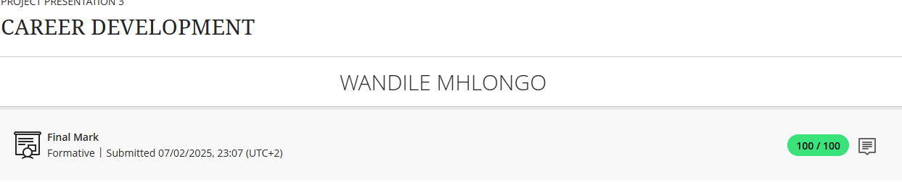
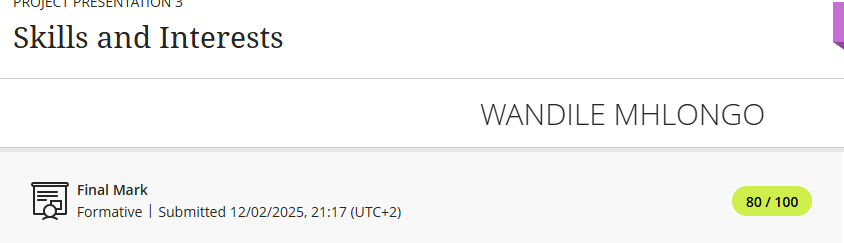
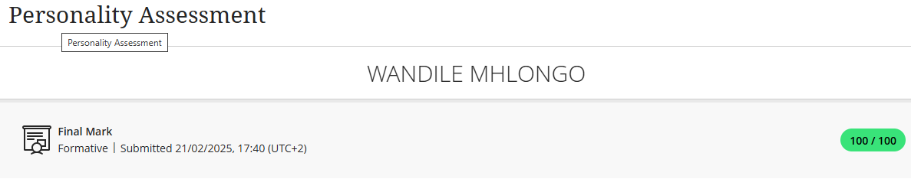

# portfolio-creation
Portfolio
# 💼 Wandile Mhlongo's Work Readiness E-Portfolio

##  Introduction
Welcome to my digital portfolio. I am Wandile Mhlongo, an ICT student majoring in Communication Networks at the Cape Peninsula University of Technology. This portfolio reflects my learning, growth, and career readiness through the Work Readiness Training program. It is structured according to key components including career counselling, personality assessment, skills, interests, and CV creation, with evidence and STAR-based reflections for each.

---

##  1. Career Counselling

###  Evidence:
-I have Participated in a career guidance session focused on aligning academic paths with career options in IT Networking.
- I also completed a goal-setting plan linked to networking career goals.

###  STAR Reflection:
- **Situation:** I was uncertain about my career path within ICT.
- **Task:** I needed to understand how to align my studies with a professional networking role.
- **Action:** I attended career counselling and completed a career planning worksheet.
- **Result:** I gained clarity on roles like Network Administrator and Security Analyst and started aligning my coursework accordingly.

---

##  2. Skills and Interests

- HTML/CSS coding 
- IP/TCP Configuration lab exercises
- Linux operating System fundamentals
- Weekly academic goals and personal interest reflection journal

###  STAR Reflection:
- **Situation:** I was assigned practical tasks during training and studies that aligned with my interests in coding and networks.
- **Task:** Apply skills in real-world scenarios and document them.
- **Action:** I developed a sample website using HTML/CSS and configured network protocols in lab simulations like Cisco Parket tracer.
- **Result:** These tasks confirmed my passion for backend systems and helped me recognize strengths in structured problem-solving.

---

##  3. Personality Assessment

###  Evidence:
- Completed a personality test during work readiness training 
- Results indicated strengths in logical thinking, analysis, and independence.

###  STAR Reflection:
- **Situation:** I participated in a personality assessment to understand my work style.
- **Task:** Use the results to reflect on how my traits affect teamwork and career choice.
- **Action:** I analyzed my results and discussed them during a feedback session.
- **Result:** I learned that my personality suits structured environments like IT networking, and I'm improving my communication skills for collaborative work.

---

##  4. Curriculum Vitae (CV)

###  Evidence:
- Developed a professional CV highlighting academic background, networking knowledge, and technical skills.

### STAR Reflection:
- **Situation:** I was required to submit a CV as part of the training.
- **Task:** Create a CV that accurately reflects my academic and professional background.
- **Action:** I used a structured CV format to list education, skills, and experience relevant to the ICT field.
- **Result:** I produced a well-formatted CV that communicates my career readiness effectively.

---

##  5. CV Submission

###  Evidence:
- Submitted my CV on time to the designated platform.
-[Download Wandile Mhlongo's Resume](Wandile%20Mhlongo%20Resume%20updated.docx)

###  STAR Reflection:
- **Situation:** The final step of the program required official CV submission.
- **Task:** Ensure my CV was ready and submitted correctly.
- **Action:** After peer review and edits, I uploaded my CV to Blackboard.
- **Result:** I met the deadline with a polished submission, showing my ability to follow professional procedures.

---

## 📌 Summary
Each section of this portfolio reflects how I’ve grown academically and professionally through structured training and self-reflection. Using the STAR technique, I’ve shown how my personality, skills, and career planning activities have prepared me for the world of work in Information and Communication Technology.

---

## 📬 Contact
- **Name:** Wandile Mhlongo  
- **Email:** mhlongowandile28@gmail.com  
  
